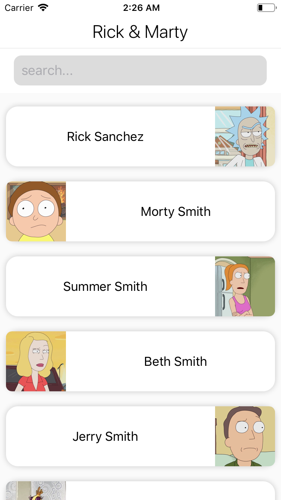
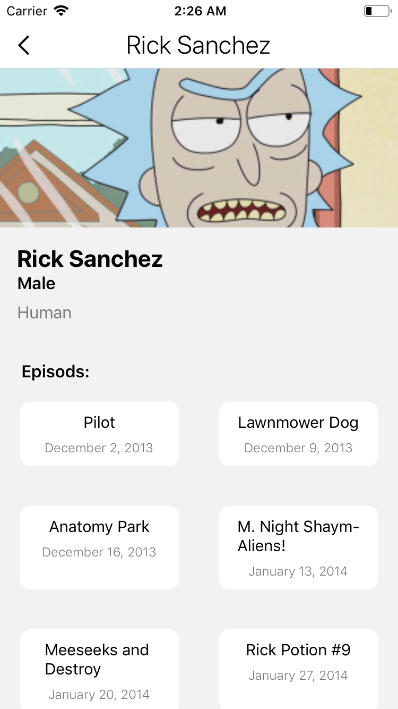

# Rick and Morty React Native
> Task Solution For Rick And Morty with React NATIVE 

## Table of Contents
* [General Info](#general-information)
* [Technologies Used](#technologies-used)
* [Screenshots](#screenshots)
* [Setup](#setup)
* [Room for Improvement](#room-for-improvement)
* [Contact](#contact)
<!-- * [License](#license) -->

## General Information

<!-- You don't have to answer all the questions - just the ones relevant to your project. -->
First Screen, Character list page:
- Create a screen that contains a list of Rick and Morty characters.
- Every item in the list should show only the ​name​ and the ​picture​ of the character.
- Implement pagination, the list should show more items when the user scrolls down.
- Add search functionality which users can filter the characters' names. Search area
should be placed at the top. The result should change on the fly while the user is typing.
Second Screen, Character details page:
- Create a second screen that contains a character's details. The App should navigate to this screen when the user selects a character from the first screen.
- Screen characters details should show the ​name​, ​picture​, ​species​, ​gender and the ​list of episodes​. An episode item contains the ​name​ and ​air date​.

## Technologies Used
- TypeScript.
- GraphQL (Apollo client).
- React navigation 5.
- Hooks.
- Unit testing .

## Screenshots

## Setup
1-clone code 
2-yarn install
3-react-native link 
4-cd ios/pod install
5-run the code 
6-npm test to run test cases 

## Room for Improvement
To do:
- Recheck the preformance 
- complete test cases to coverage 100% of code 
- solve the issue for fetch more 
- adding some extra scope and update design 

## Contact
Created by Hagar Abdelghafar

<!-- Optional -->
<!-- ## License -->
<!-- This project is open source and available under the [... License](). -->

<!-- You don't have to include all sections - just the one's relevant to your project -->
